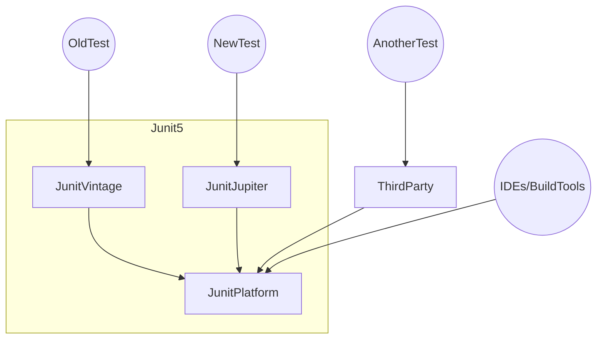
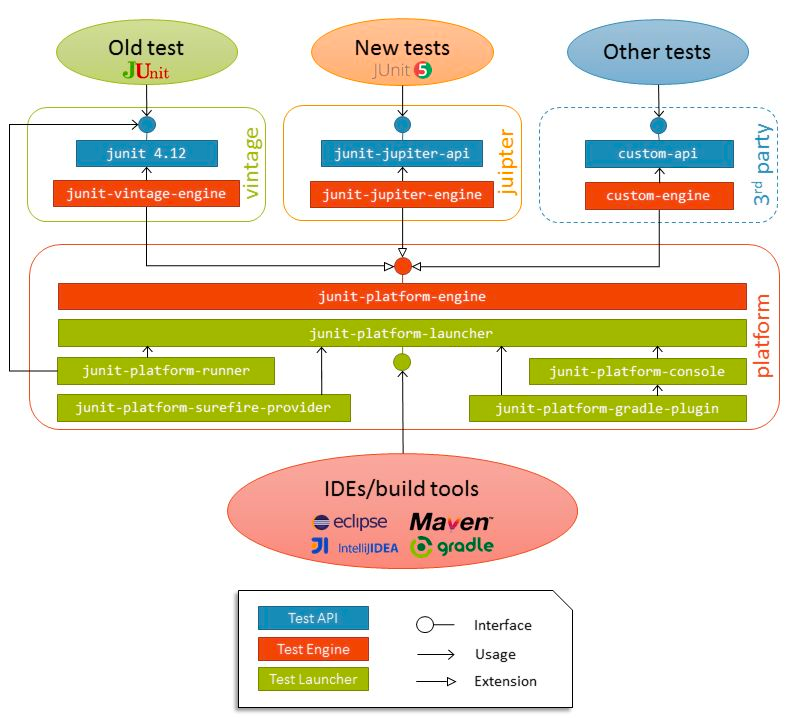

# 테스트
## 테스트 코드를 작성해야 하는 이유 
- 우리가 작성한 코드가 제대로 동작하는지 알기 위함 
- 테스트 자동화를 통해 CI/CD 프로세스를 만들 수 있음 
- 테스트 코드가 QA를 완전히 대체하기는 어려우나, 어느 정도 일손을 덜어줄 수 있음
- 테스트 코드가 우리의 코드가 잘못되었음을 알려줌 (테스트에게 코드 리뷰를 받을 수 있음)
  - 예를 들어, 테스트 코드가 작성하기 어려운 로직이 있다면, 그것은 잘못 구성된 로직일 가능성이 큼
  - 항상 테스트하기 쉬운 코드를 작성하도록 노력하자 


## 테스트의 3분류
테스트는 크게 3개의 분류로 나눌 수 있다. 
- API 테스트 (E2E)
- 통합 테스트 
- 단위 테스트 

### API 테스트 
- 멀티 서버 테스트 
  - 해당 테스트에 여러 서버가 관여될 수 있음 (ex: 프론트 서버 ~ 백엔드 서버 or 백엔드 서버 간)
- End to end (E2E) 테스트라고도 불린다 
- 특징
  - 테스트 결과가 상대적으로 불안정하여, 예상치 못한 이유로 실패할 수 있다

### 통합 테스트
- 단일 서버 테스트 
  - 해당 테스트에 단일 서버만 관여함 (ex: 결제/정산 서버 내에서 테스트)
- 멀티 프로세스 or 멀티 스레드 테스트 
  - 해당 테스트에 여러 프로세스 혹은 스레드가 관여할 수 있음 
    - 즉, 디스크 I/O, 네트워크 I/O 등 I/O 작업이 관여할 수 있음 (ex: DB 커넥션 연결, 외부 API 호출 등) 
- 테스트용 DB를 사용할 수 있음
  - ex: H2 database 등 인메모리 DB, TestContainer... 

### 단위 테스트 
- 단일 서버 테스트 
  - 해당 테스트에 단일 서버만 관여함 (ex: 결제/정산 서버 내에서 테스트)
- 단일 프로세스 or 단일 스레드 테스트
  - 해당 테스트에 단일 프로세스 혹은 스레드만 관여해야 함 
  - 즉, 디스크 I/O, 네트워크 I/O 등 I/O 작업이 관여할 수 없음. (Blocking call을 허용하지 않음)


## 테스트 관련 용어 정리 
### SUT 
- System under the test
- 테스트하려는 대상을 의미 

### TDD
- 테스트 주도 개발 

### BDD
- Behaviour driven development (given-when-then)
- 시나리오에 기반한 테스트를 수행하는 방식
    - 어떤 상황이 주어지고, 어떤 행동을 할 때, 이렇게 되더라 

### 테스트 더블 
- Double은 두배..가 아닌 **대역**을 의미
  - 즉, Test double이란, **테스트 대역**을 의미한다
- 테스트 대역은 여러 종류가 있다.
  - Dummy
    - 아무런 동작도 하지 않고, 그저 코드가 정상적으로 돌아가기 위해 전달하는 객체를 의미 
  - Fake
    - Local 혹은 Test에서 사용하기 위해 만들어진 가짜 객체 
    - 자체적인 로직이 있다는 것이 특징 
  - Stub 
    - 미리 준비된 값을 출력하는 객체 
    - 주로 외부와 연동하는 컴포넌트들에 많이 사용한다 
    - Mockito 프레임워크 이용 
  - Mock
    - 메소드 호출을 확인하기 위한 객체
    - 자가 검증 능력을 갖춤
    - 사실상 테스트 더블과 같은 의미
  - Spy
    - 메소드 호출을 전부 기록했다가, 나중에 확인하기 위한 객체 


## Junit5
### Architecture
- 3개의 모듈로 구성되어 있음 
  - Junit Platform
    - JVM에서 테스트 프레임워크를 사용하기 위한 기반 역할 
    - 콘솔, IDE, 빌드 tool에서 테스트를 시작하기 위한 API를 제공 
  - Junit Jupiter
    - Junit5의 주요 모듈
    - Junit5의 테스트를 작성할 수 있는 API를 제공한다.
  - Junit Vintage
    - Junit3, Junit4를 지원하여, 이전 버전과의 호환성을 보장 




- Junit5를 사용하게 되면...
  - 우리의 테스트는 `junit-jupiter-api`라는 인터페이스를 사용한다.
  - `junit-jupiter-engine`은 `junit-jupiter-api`를 사용한다.
  - `junit-jupiter-engine`은 `junit-platform-engine`이라는 인터페이스를 구현하고 있다.
  - 대략 이런 그림이 아닐까...
    ```java
    interface JUnitJupiterApi {}
    
    interface JUnitJupiterEngine implements JUnitPlatformEngine {
        JUnitJupiterApi api;
    }
    ```
    
- IDEs/BuildTools는 `junit-platform-launcher`라는 인터페이스를 사용한다.

### 대략적인 동작 방식
- JUnit5는 테스트를 실행할 때마다 새로운 객체를 생성하고 테스트를 실행한다. 
```java
public class JUnitTest {
    static Set<JUnitTest> testObjects = new HashSet<>();

    @Test
    void objTest1() {
        assertThat(testObjects).doesNotContain(this);
        testObjects.add(this);

        System.out.println("[Test1] testObjects = " + testObjects);
    }

    @Test
    void objTest2() {
        assertThat(testObjects).doesNotContain(this);
        testObjects.add(this);

        System.out.println("[Test2] testObjects = " + testObjects);
    }

    @Test
    void objTest3() {
        assertThat(testObjects).doesNotContain(this);
        testObjects.add(this);

        System.out.println("[Test3] testObjects = " + testObjects);
    }
}
```

```text
// 결과
[Test1] testObjects = [hello.test.junit.JUnitTest@13df2a8c]
[Test2] testObjects = [hello.test.junit.JUnitTest@13df2a8c, hello.test.junit.JUnitTest@13bc8645]
[Test3] testObjects = [hello.test.junit.JUnitTest@24c22fe, hello.test.junit.JUnitTest@13df2a8c, hello.test.junit.JUnitTest@13bc8645]
```


## 참고 자료
- [JUnit5 Architecture](https://freecontent.manning.com/junit-5-architecture/)
